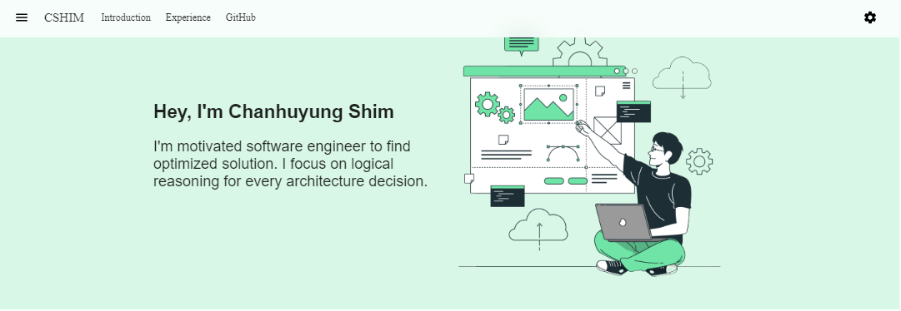

# Welcome to GT-Time, Georgia Tech schedule builder repo

This repository contains the source code for:

* [getcshim](https://www.getcshim.com/)

## Prerequisites
* python (3.9.13+)
* pip (21.3.1+)

## Installation

Create and activate virtual environment\
`python -m venv .virtualenvs && .virtualenvs\scripts\activate.bat`

Install the packages\
`pip install -r requirements.txt && nodeenv -p`

Navigate to frontend directory and Install the npm packages\
`cd web/frontend && npm install`

Refer to readme in frontend directory for commands

## Design

App was designed with strategy written from [Thinking in React](https://reactjs.org/docs/thinking-in-react.html)

## Contribution

* Chanhuyng Shim :
    [@Shim\GaTech](https://www.linkedin.com/in/chanhuyng-shim-998456196/)

## Credit


## License
```xml
Copyright 2022 Chanhuyng Shim

Licensed under the Apache License, Version 2.0 (the "License");
you may not use this file except in compliance with the License.
You may obtain a copy of the License at

    http://www.apache.org/licenses/LICENSE-2.0

Unless required by applicable law or agreed to in writing, software
distributed under the License is distributed on an "AS IS" BASIS,
WITHOUT WARRANTIES OR CONDITIONS OF ANY KIND, either express or implied.
See the License for the specific language governing permissions and
limitations under the License.
```

[store-install]: https://play.google.com/store/apps/details?id=com.gttime.android&hl=en_US&gl=US
